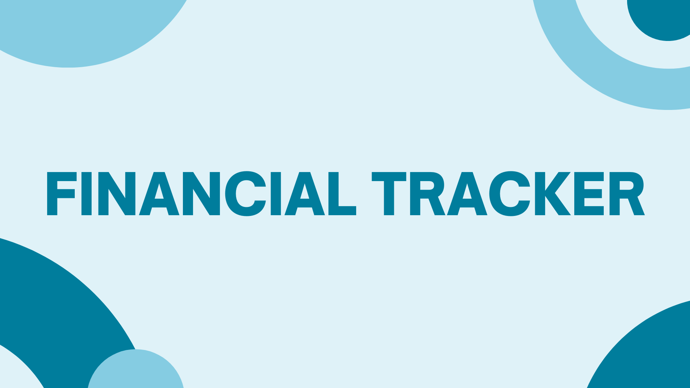

# Financial Tracker

## 📃 Description
**Financial Tracker** is a web application designed to help users manage their personal finances, set savings goals, and track progress. With this tool, you can easily monitor your spending, set financial goals, and track your savings over time.

## 🚀 Key Features
- 🏦 **Goal Management**: Create, update, and manage financial goals like saving for a vacation, buying a new gadget, or paying off debt.
- 💰 **Savings Tracking**: Track the amount you've saved towards each goal and monitor your progress.
- 💸 **Transactions Managment**: Add, delete and classify transactions, whether they are expenses or income.
- 📊 **Transaction filtration** Filter transactions and and get the transactions you are interested in.

## 🛠 Technologies Used
- **Frontend**: EJS, HTML, CSS
- **Backend**: Node.js, Express
- **Database**: MongoDB
- **Authentication**: JWT (JSON Web Tokens)

## 📖 How to Use
- Register: Create an account and log in
- Create a transaction: Start by creating a transaction.
- Add Goal: Add a goal and its deadline.
- Manage Budget: Manage your budget by adding different transactions and completing goals.

## 🖥️ API documentation